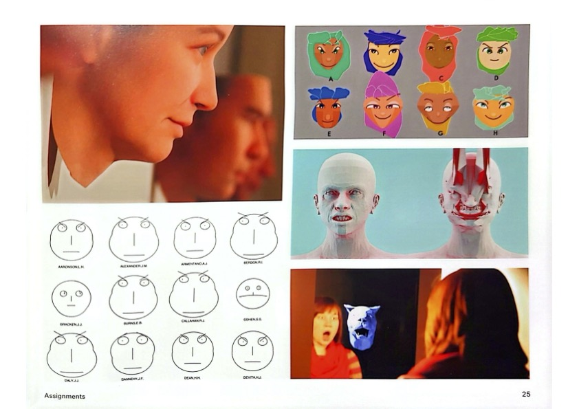

# Sketch 2 - 4

## Sketch 2: **Creating 1 face -Due September 26th by NOON**

## Sketch 3: Parameterizing that face & organize code for variability (functions, variables, parameters) - Due October 3rd by Noon

## Sketch 4: Port to P5.js & Further Manipulate, iterate, add interactivity/variability and something to control that variability, etc. - Due October 10th by Noon

## Face Generator

Write code to design an image of a face that is parameterized by at least 3 dimensions of variability, but preferably more. For example, you might have variables that specify the size, position, color, or other visual characteristics of the eyes, nose, and mouth. The variations in these features may be used to alter the face's expression (happy, sad, angry); the face's identity (John, Yara); and/or the face's species (cat, monkey, zombie, alien). Give special consideration to controlling the precise shape of face parts, such as the curve of the nose, chin, ears, and jowls, as well as characteristics for skin color, stubble, hairstyle, blemishes, interpupillary distance, facial asymmetry, cephalic index and prognathism. Differentiate continuous parameters (such as size and positions of the features) and discrete parameters (such as the presence of piercings, or the number of eyeballs). Will your faces show frontal, profile, or three-quarters view? Your system should generate a new face, whenever the user presses a button.

## Learning Objectives

* Design parametric forms using drawing functions and the Cartesian coordinate system
* Apply generative design principles to expressive character design
* Conduct a meta-design (design a system to design things)

<figure><figcaption></figcaption></figure>

